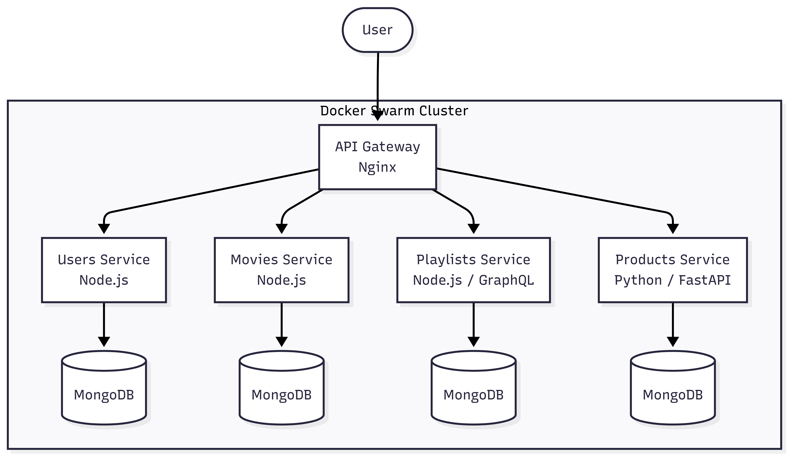

# CinemasApp - Cinema Management System

## About the Product
CinemasApp is a management software designed for cinema operations. The solution allows managing the movie catalog, organizing playlists with ad insertions, managing user accounts, and processing product sales with inventory control.

## Architecture
The system adopts a microservices architecture. Network traffic is routed through an Nginx-based API gateway, which forwards requests to the appropriate services.

**

## Services and Responsibilities
The project is divided into four main domains:
* **Users:** Service responsible for registration and authentication.
* **Movies:** Service dedicated to the movie catalog.
* **Playlists:** Service that organizes screenings and advertising, supporting an application programming interface (API) in GraphQL format.
* **Products:** Service that logs sales operations and updates inventory quantities in real time.

## Architecture Decisions and Trade-offs
The choice of a microservices structure allows for the independent growth of each component. The system uses multiple programming languages, utilizing Node.js and Python, to explore the ideal resources of each technological ecosystem. This technical decision increases flexibility but introduces higher maintenance complexity. For infrastructure management, the project uses Docker Swarm.

## API Documentation
Services built in Node.js automatically generate documentation through the Swagger tool. The graphical documentation interface can be accessed on the defined ports for each service after initialization. The products service provides its documentation natively through FastAPI.

## Installation and Execution
The following steps explain how to run the system:

1. **Environment Variables Configuration**
First, the environment variables file must be created in the project's root folder. An example file is available.
```bash
# Copy the example environment variables file and configure it
cp .env.exemple .env
```

2. **Orchestrator Initialization**
If container orchestration is not active, the process must be started using Docker's native tool:
```bash
# Initialize Docker Swarm cluster
docker swarm init
```

3. **Services Deployment**
To start the system, the following command is executed to use the provided configuration file:
```bash
# Deploy the microservices stack using Docker Compose for Swarm
docker stack deploy -c docker-compose-swarm.yml cinemas_app
```

4. **Access and Verification**
After successful deployment, the services become operational. The gateway handles routing API requests to their respective destinations. The endpoints documentation can be verified in the routes configured for Swagger or in the native documentation associated with the products.

## References
* CinemasApp project structure and files from the andresantos303/cinemasapp repository.
